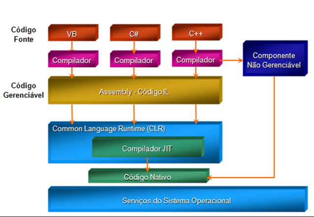

# O que e .NET?

Antes de tudo precisamos entender o que eh um framework, um framework eh um conjunto de bibliotecas/funcionalidades muito bem estruturadas que utilizamos para construir nossas aplicacoes, simplificando, nada mais eh do que um monte de codigo pronto para utilizarmos, sem precisar ficar reinventando a roda.

Utilizamos um framework para nao precisar construir tudo do 0.

- Exemplo: Em um aplicativo WEB com ASPNET, nao precisamos mapear o body de uma request, o framework ja faz isso automatico para nos.

- Para criar paginas web com bootstrap/Meterialize, nao precisamos criar todo o html e css, existem diversos recursos que simplificam isso para nos.

- Para criar aplicacoes SPA(Single Page Application), podemos utilizar o Angular.

O .NET eh um framework criado pela microsoft por volta de 2001.

Atualmente .NET eh uma plataforma/ambiente de desenvolvimento gratuita, multiplataforma e opensource.

Com .NET podemos criar inumeros tipos de aplicativos, por exemplo: Aplicativos de console, Aplicativos WEB, APIs WEB, Microsservicos, Jogos, Desktop, Servicos de segundo plano (Workers), aprendizado de maquina e IOT.

O .NET possui uma alta performance e eh utilizado em producao por muitos aplicativos de pequena e grande escala.

# NET 6, .NET Core ou .NET Framework?

Vamos falar primeiramente do **.NET Framework.**

- Teve sua primeira versao por volta de 2001.
- Pode ser instalado Side by Side
- So poderiamos utilizar esse framework no windows
- Hoje esta quase sendo considerado como um legado

O **.NET Core** foi lancado por volta de 2015 e foi uma grande sacada da microsoft, a partir dessa versao o framework passou a ser:

- Multiplataforma (Windows, MAC e Linux)
- Open Source
- Grandes melhorias de performance
- Ainda continua sendo Side by Side.

Essa nova versao do framework da microsoft foi reescrito do 0. Sabemos que escrever tudo do 0 ou trocar todos os componentes de um framework nao eh uma tarefa facil e gera muitas feridas na comunidade de desenvolvimento de softwarte, um exemplo de migracao que gerou muitas dores foi no angular.js para a versao mais atual do Angular.

Pensando nisso a microsoft manteve um retrocompatibilidade entre o **.NET Framework** e o .**NET Core**.

Com essa migracao veio um grande problema junto, eu precisaria migrar toda a minha aplicacao para utilizar o **.NET Core,** reescrever tudo do zero? A resposta para isso eh nao. Pensando em resolver esse problema a microsoft criou o .**NET Standart**, ou seja, tudo que eu escrever em **.NET Standart** podera ser utilizado tanto com o **.NET Framework**quanto com o .NET Core.

A partir do **.NET 5** nao precisamos mais utilizar o **.NET Standart**, mas, se quiser compartilhar codigo entre o .NET Framework e qualquer outra versao mais recente podera utilizar o **.NET Standart na versao 2.0**.

Falando um pouco mais sobre **.NET 5/6/7**.

Com essa nova versao, nao sera mais necessario utilizar o **.NET Standart**, porque o framework ja alcansou um nivel de maturidade tao grande quanto o **.NET Framework**, entao para a microsoft nao faz mais sentido manter as duas versoes do framework, em breve o **.NET Framework** sera descontinuado e perdera seu suporte.

# C#, Fortemente tipado, Gerenciado e Compilado.

O **C#** eh uma linguagem de programacao criada por Anders Hejlsberg por volta de 2001. Hoje o **C#** eh a princiapal linguagem de programacao da microsoft.

O **C#** possui algumas caracteristicas, sendo elas:

- Fortemente tipada
- Compilada
- Gerenciada
- Orientada a objetos

Vamos entender um pouco mais sobre esses termos.

## Fortemente Tipada

Ser fortemente tipada, significa que no momento da declaracao de uma variavel, classe ou metodo, temos que definir o seu tipo. Algumas linguagens de programacao nao sao fortemente tipadas, como por exemplo o PHP e o Javascript, isso permite que o tipo de uma variavel por exemplo passa ser alterado em tempo de execucao. Veremos alguns exemplos mais a frente.

## Compilada

O codigo fonte escrito em C# eh compilado para uma linguagem intermediaria, que chamamos de IL (Intermediate Language), o codigo IL sao armazenados em um assembly, com extensao .dll ou .exe.

Quando um programa em C# eh executado, a CLR(Common Language Runtime) executa a compilacao JIT(Just In Time) para converter o codigo IL em codigo de maquina nativo.

## Gerenciada

Uma linguagem ser gerenciada significa que para sua execucao ocorrer corretamente eh necessario fazer o uso de um gerenciador, ou tambem conhecimento como **runtime**.

Em C#/.NET o gerenciador eh conhecido como CLR (Common Language Runtime).

A CLR e responsavel por, gerenciar memoria, tratamento de excecao, acesso a recursos do sistema operacional e entre outras funcionalidades.

Uma das vantagens de ser ter uma CLR eh que quase nao precisamos interageir com recursos de maquina e com isso nos sobra tempo para focar em regras de negocio da aplicacao.

# Referencias

- [Documentacao Oficial C#](https://docs.microsoft.com/pt-br/dotnet/csharp/tour-of-csharp/)
- [Documentacao Oficial .NET](https://docs.microsoft.com/pt-br/dotnet/standard/clr)
