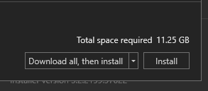

# Instalacao do SDK do .NET 6

Para instalar o .NET basta acessa o link [.NET SDK](https://dotnet.microsoft.com/en-us/download)

Nesta tela teremos a opcao de instalar o .NET em varios sistemas operacionais, como Windows, Mac, Linux.


Como estamos no windows, podemos clicar em Download .NET SDK x64, neste momento a versao disponivel para baixar e o .NET 6.

Mas nao vamos instalar dessa forma, vamos clicar no link [All .NET versions](https://dotnet.microsoft.com/en-us/download/dotnet). Nesta pagina podemos ver varias versoes do .NET, eh muito importante escolher a versao correta para iniciar nossas aplicacoes, o mais recomendado eh escolher as versoes LTS (Long-term support), versoes LTS tem o periodo suporte prolongado pela microsoft (03 anos).


Neste momento a versao LTS mais recente eh o .NET 6, vamos escolher este SDK (Software Development Kit) e fazer o download, a instalacao no windows eh simples, basta clicar no executavel e seguir o passo a passo da intalacao.


A instalacao no windows eh basicamente "next, next, finish", bem simples de se fazer. Depois que a instalacao for concluida vamos executar o seguinte comando no terminal:

```
dotnet --version
```

Depois de executado a seguinte saida eh esperada no terminal:


Bem simples nao?

Fizemos a instalacao do SDK do .NET em apenas alguns cliques, e agora podemos comecar a conhecer um pouco mais essa plataforma de desenvolvimento incrivel criada pela microsoft.

# DOTNET CLI

A dotnet CLI (Command line interface), eh uma ferramenta muito util que vai nos auxiliar no desenvolvimento de nossas aplicacoes, com ela podemos criar aplicacoes, executar, publicar aplicacoes dotnet, tudo isso por linha de comando.

A CLI do .NET ja esta incluida na instalacao do dotnet SDK.

## Principais comandos.

No inicio desse assunto ja executamos um comando, executamos o `dotnet --version`. Esse mostra a versao do SDK instalado na nossa maquina.

O comando dotnet basicamente tem duas funcoes:

1. Comandos para se trabalhar com dotnet
2. Executar aplicativos dotnet

## Exibindo informacoes do ambiente

```
dotnet info
```

Mostra as principais informacoes da instalacao atual do dotnet.

## 

```
dotnet --version
```

Mostra a versao do SDK.

## 

```
dotnet --list-sdks
```

Mostra todos os SDKs intalados na maquina.

## 

## Comandos Gerais

- `dotnet build` - Compila um projeto e todas as suas dependencias.
- `dotnet clean` - Limpa a saida de um projeto (Resultado de um dotnet build)
- `dotnet new` - Cria um novo projeto, arquivo de configuracao e etc. Alguns exemplos de projetos que podemos criar com este comando:

```
dotnet new console - Cria um novo projeto do tipo console.
dotnet new webapi - Criar um novo projeto do tipo API Web do ASP.NET Core
dotnet new gitignore - Cria um arquivo de configuracao do git para ignorar tipos de arquivos/diretorios e etc.
```

- `dotnet restore` - Restaura as dependencias de um determinado projeto.

- `dotnet run` - Executa um aplicativo dotnet.
- `dotnet test` - Executa os testes de um aplicativo dotnet.

Existem varios comandos da CLI que podemos executar para facilitar a criacao de projetos dotnet ou ate mesmo a publicacao. Muitos desses comandos tambem podem ser abstraidos por IDE`s (Ambiente de desenvolcimento integrado), que tambem nos auxiliam no desenvolvimento de aplicacoes.

Para qualquer comando que tivermos duvidas sobre quais parametros podem ser passados podemos sempre utilizar --help para obter mais informacoes e ajuda sobre o comando que estamos querendo executar, exemplo:

```
dotnet new  --help
```

O camando nos mostra todas as opcoes que temos para utilizar junto com o dotnet new e uma breve descricao sobre cada uma das opcoes.

## 

# IDE - Ambiente de Desenvolvimento integrado

## Visual Studio

Atualmente dificilmente algum desenvolvedor vai deixar de usar algum tipo de IDE ou editor de codigo fonte.

Comecando pela IDE, esse aplicativo eh rico em funcionalidades que facilitam o dia a dia da vida de um desenvolvedor de aplicacoes.

Falando especificamente para .NET, a IDE utilizada eh o Visual Studio. O visual Studio nos auxilia na criacao, edicao, depuracao, compilacao e publicacoes de aplicativos dotnet.

Na proxima imagem temos uma visao geral do Visual Studio:

## 

Existem muitos recursos extremamente uteis no Visual Studio, como o
Code Cleanup, Refactoring, IntelliSense e diversas de outras funcionalidades muito uteis que vamos aprender ao longo do treinamento.

O Visual Studio esta disponivel para Windows e MAC.

Atualmente temos 03 versoes do Visual Studio e podemos comparar os recursos de cada uma [aqui](https://visualstudio.microsoft.com/vs/compare/).

## Rider

Como vimos anteriormente o Visual Studio funciona para Windows e MAC, mas como ficam as pessoas que gostam de utilizar LINUX?

Infelizmente nao temos uma versao do Visual Studo para linux, mesmo o .NET sendo multiplataforma a microsoft ainda nao disponibilizou essa ferramente para a LINUX.

Uma opcao seria utilizar o Visual Studio Code, porem eu considero utilizar o Code apenas para aprendizado, em aplicacoes muito grandes acredito que o code vai mais atrapalhar do que ajudar, pela falta de recursos e alguns gargalos que ele apresenta quando o projeto cresce.

Como alternativa para LINUX podemos utilizar o JetBrains Rider.

Essa IDE eh fantastica e possui muitos recursos assim como o Visual Studio.

O unico "problema" do RIDER eh que existe um valor a ser pago para utilizar a IDE. Mas em alguns casos, faz muito sentido para este valor para poder utilizar essa ferramenta fantastica da JetBrains.

O Rider funciona em Windows, MAC e Linux.

## 

Podemos saber um pouco mais do Rider [aqui](https://www.jetbrains.com/pt-br/rider/).

## Instalando o Visual Studio

Para instalar o Visual Studio podemos acessar este [link](https://visualstudio.microsoft.com/thank-you-downloading-visual-studio/?sku=Community&channel=Release&version=VS2022&source=VSLandingPage&cid=2030&passive=false) e fazer o download da ferramenta.

Este processo ira baixar o instaldor do Visual Studio.

## 

O Processo de instalacao do Visual Studio eh bem simples, basta ir clicando em next nas maiorias das opcoes.

Chegando nessa tela, podemos escolher algumas cargas de trabalho (Workloads).

## 

Por exemplo, se vamos trabalhar apenas com aplicacoes DESKTOP, nao temos porque instalar recursos para se trabalhar com aplicacoes WEB, dessa forma otimizamos nossa IDE instalando dela apenas os recursos necessarios.

Em Web e Cloud vamos selecionar:

## 

Em Desktop e Mobile vamos selecionar:

## 

Em Others e Toolsets vamos selecionar:

## 

Por padrao o idioma do Visual Studio eh o Ingles, mas podemos instalar o pack de linguagem para suportar o Portugues do Brasil.

Selecione a aba Language packs.

Nela ja vai estar selecionado o idioma Ingles, recomendo nao remover e posteriormente clicar em Portuguese - Brazil.

Dessa forma, ficara disponivel o idioma e poderemos alterado depois da instalacao.

Segue imagem de exemplo:

## 

No momento da instalacao selecione na caixa de selecao "Download all, then install". Depois clique em instalar e espere o download e a instalacao do Visual Studio Community.

## 

## 

## Tipos de projetos e dubugando nossa primeira aplicacao.

Vamos conhecer agora alguns tipos de projetos que podemos criar com o Visual Studio.

Vimos alguns exemplos atras que alguns desse projetos podemos criar tambem com a CLI do dotnet.

As duas formas funcionam muito bem e podemos escolher a que melhor se encaixa no momento.

Vamos la.

Abra o Visual Studio e selecione "Create a new Project".

## 

Na tela que se abre podemos escolher o tipo de projeto que queremos trabalhar.

## 

Nesta tela podemos aplicar alguns filtros, sendo eles: Filtros de linguagens (C#, Javascript, C++), podemos tambem escolher a plataforma que desejamos (Android, Windows, Linux, MAC) e tambem podemos escolher o tipo de projeto (Console, Web API, ClassLib).

Esses filtros sao bem uteis para ajudar a localizar a solucao ideal para o tipo de aplicacao que vamos construir.

Ao lado esquerdo tambem tem um recurso muito util, que sao os ultimos projetos que selecionamos.

Para este primeiro exemplo vamos selecionar o projeto do tipo Console.

Para isso na barra de busca digite console. Depois do filtro, vai ser exibido alguns projetos do tipo console, cada projeto desse tem uma caracteristica diferente, alguns estao utilizando VB e F# como linguagem, outros estao utilizando alguma outra versao do framework dotnet.

Vamos selecionar a primeira opcao, repare que ela esta mostrando que podemos trabalhar com esse projeto com C#, nos ambientes LINUX, MAC E Windows, sabemos que a nova versao do framework da microsoft eh multiplataforma entao, esta correta a selecao deste tipo de projeto.

## 

Na proxima tela podemos escolher o nome da nossa aplicacao, o local onde vamos salvar os arquivos da aplicacao e o nome da solucao.

## 

Se tivermos mais de uma versao do dotnet instalada, tambem podemos escolher a versao que vamos utilizar, podemos alterar isso posteriomente.

## 

## Debugando a aplicacao

Criado o projeto, vamos criar um programa simples responsavel por somar dois numero e imprimir o resultado no console.

```C#
int primeiroNumero = 10;
int segundoNumero = 10;
int resultado = primeiroNumero + segundoNumero;
Console.WriteLine(resultado);
```

A Saida desse programa sera 20.

Antes de eecutar nosso projeto, podemos rodar o comando build, esse comando vai compilar nossa aplicacao e se conter algum erro, como erro de sintaxe a compilacao ira falhar e a IDE ira mostrar para nos o motivo do erro.

Por exemplo, altere o codigo para e clique em Build => Build solution

```C#
int primeiroNumero = 10;
int segundoNumero = 10;
int resultado = primeiroNumero + segundoNumero;
Console.writeLine(resultado);
```

A propria IDE ira apontar que tem algum erro com o nosso codigo, veja:

## 

Essas dicas sao muito uteis, assim nao precisamos compilar o projeto para corrigir o erro.

o Resultado do build com erro sera esse aqui:

## 

Basicamente digitamos incorretamente o comando WriteLine, apos corrigir a sintaxe do comando podemos executar novamente nossa aplicacao e vamos obter a saida 20 no console.

Para executar basta clicar no Icone de "play" verde, com o nome da nossa aplicacao.

Podemos escolher em qual modo nossa aplicacao sera executada, sendo eles: Debug e Release.

Ao longo do treinamento, vamos aprender diversas funcionalidades do Visual Studio, inclusive vamos aprender a criar varias configuracoes para rodar nossa aplicacoes.

# Referencias

- [Documentacao Oficial .NET - dotnet CLI ](https://docs.microsoft.com/pt-br/dotnet/core/tools/)
- [Documentacao Oficial .NET - Visual Studio ](https://docs.microsoft.com/en-us/visualstudio/get-started/visual-studio-ide?view=vs-2022)
