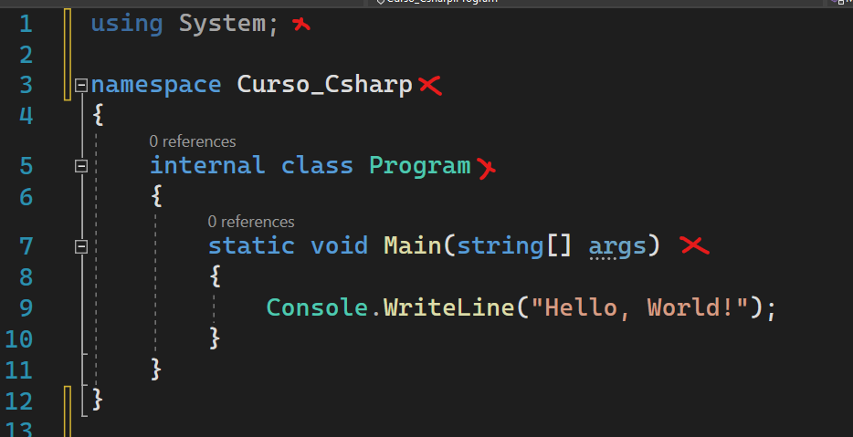
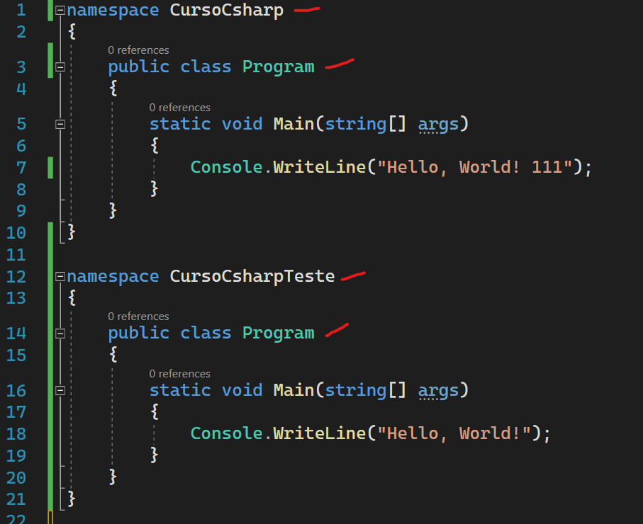
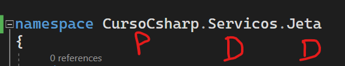
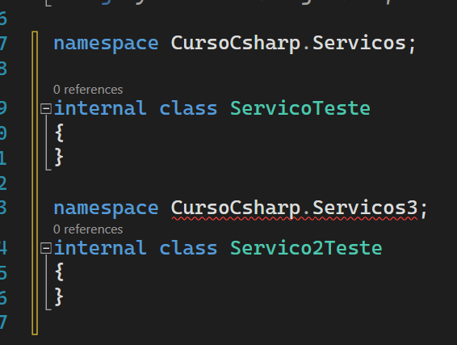

# Linguagem de programacao C# - Base da linguagem

## Escopo de um programa

Em um programa dotnet normalmente temos a seguinte estrutura dentro de um arquivo. (Antes da versao 6 do dotnet)

1. Importacoes (Usings)
2. Namespaces (Separacao logica)
3. Classes
4. Um metodo principal.

Quando estamos escrevendo nossos codigos, dificilmente vamos escrever tudo do zero, o intuito de utilizar um framework eh justamente esse, facilitar nossa vida com implementacoes que seriam triviais no desenvolvimento de uma aplicacao. Entao, quando precisamos por exemplo escrever alguma informacao no console (Telinha preta do windows), nao precisamos criar uma integracao do 0 com esse componente do windows, a aplicacao ja nos da o suporte para isso, para isso precisamos apenas fazer o import no namespace System e utilizar o metodo Console.WriteLine("Meu texto aqui"). Vamos entender ao longo do curso a utilizar usings para utilizar funcionalidades prontas na nossa aplicacao.

Namespaces nada mais eh do que uma separacao logica em nossa aplicacao, imagina que voce tenha a necessidade de ter duas classes com o mesmo nome dentro da aplicacao, sem o uso de namespaces isso nao seria possivel, uma vez que iria dar conflitos com os nomes iguais. Porem com o uso de namespaces podemos separa os contextos da nossa aplicacao em "diretorios virtuais", e com essa funcionalidade podemos ter dois arquivos com o mesmo nome separado em namespaces diferentes, muito bom nao acham?

Vamos aprender o que realmente eh uma classe e sua importancia quando formos falar de orientacao a objetos, mas para nao deixar passar em branco, vamos simplificar a sua utilizacao. Uma classe nada mais eh do que um tipo de dados, como se fosse um int, string e etc. Mas diferentemente de um tipo int, uma classes possui estado e nenhum ou mais metodos para manipular seu estado.

E por fim temos o metodo principal, esse metodo eh a porta de entrada da nossa aplicacao, comumente chamamos esse metodo de SVM (static void main).
Basicamente toda aplicacao dotnet possui um metodo SVM.

## 

## Namespaces e usings

### Namespaces

Quando pensamos em organizar arquivos, logo pensamos em pastas, diretorios e etc. Essa forma de organizacao eh super valida quando estamos criando nossos programas em dotnet, mas tambem podemos utilizar de um recurso super importante que sao os namespaces.

Os namespaces sao separacoes logicas, que permitem organizar melhor os nossos codigos. Com o uso de namespaces podemos ter varias classes com o mesmo nome (Nao que isso seja bom, mas podemos) em namepaces diferentes.

Veja no exemplo um mesmo arquico csharp com dois namespaces diferentes e dentro de cada namespace uma classe com o mesmo nome.

## 

Mas como se cria um namespace? Normalmente o nome do namespace segue a seguinte estrutura **"nome-projeto.diretorio-onde-se-encontra"**.

## 

P - nome projeto | D - Nome diretorio na aplicacao.

Nas versoes anteriores ao dotnet 6, era-se obrigado a abrir e fechar chaves {} apos a definicao de um namespace. Nas versoes mais recentes (dotnet 6+) nao precisa mais criar esse tipo de estrutura, porem pode-se apenas definir um namespace por arquivo nessa nova estrutura. Essa nova forma de declaracao chama-se "file-scoped namespaces".

## 

Por convencao, o ideal eh ter apenas um namespace por arquivo.

Um namespace nao limita-se a apenas um arquivo, posso ter dois arquivos com o mesmo namespace, isso eh muito comum inclusive. Quando formos contruir nossa aplicacoes vamos ver exemplos praticos da vida real com isso.

Lembra o using que vimos na sessao anterior? Quando utilizamos um using, estamos falando para a nossa classe que queremos utilizar as funcionalidades que temos dentro do namespace que declaramos.

Dentro no namespace "System" temos uma classe estatica chamada "Console" e dentro dessa classe temos um metodo estatico chamado WriteLine. Se nao utilizassemos o using na nossa classe teriamos que usar o metodo da seguinte forma: **System.Console.WriteLine("meu texto").**

### Usings

Para podemos utilizar alguns recursos do framework ou recursos que criamos nas nossas bibliotecas, temos que utilizar a palavra reservada using.

Por padrao o dotnet vem carregado com algumas funcionalidades e quando desejamos fazer uso de uma determinada funcionalidade ou recursos, utilizamos o using para que nossa aplicacao reconheca aquela funcionalidade.

Nas versoes anteriores ao dotnet 6 precisamos colocar varios usings semalhantes em quase todas as classes da nossa aplicacao, porem a partir do dotnet 6 foi implementado um recurso muito legal chamado "Global usings", onde para cada tipo de aplicacao/projeto sao importados de forma global varios namespaces que com certeza serao utilizados naquele projeto.

Normalmente as instrucoes usings sao declaradas no comeco do arquivo.

Podemos ver mais sobre global usings - [AQUI](https://docs.microsoft.com/en-us/dotnet/csharp/whats-new/csharp-10#global-using-directives)

## Palavras reservadas

Podemos escrever qualquer coisa nos nossos codigos desde que ele respeite as diretrizes da linguagem que estamos trabalhando, por exemplo: O C# ele eh case sensitive, isso significa que ele diferencia letra maiusculas de letras minusculas, vamos ver varios exemplos disso ao decorrer do treinamento.

Ou diretriz muito importantes sao as palavras reservadas da linguagem ou tambem conhecidas como keywords. As keyswords sao palavras que possuem um significado especifico para o compulador do C#. Por exemplo, nao posso declarar uma variavel com o nome de "int", porque int eh uma keyword que se refere a um tipo primitivo do C#, eu so poderia utilizar "int" se ele tivesse um prefixo "@" ou seja, "@if". Mas calma, nao precisamos decorar todas as keywords do C#, com o tempo as coisas ficam mais naturais e tambem a propria IDE nos auxilia nisso.

Podemos ver [AQUI](https://docs.microsoft.com/pt-br/dotnet/csharp/language-reference/keywords/) uma lista com as keywords do C#.

## Tipos primitivos

Tipos primitivos ou "built-in types" sao tipos base em dotnet. Por exemplo, seu eu quero represetar um numero inteiro, nao preciso criar uma classe ou uma struct para fazer isso, no dotnet existe o tipo primitivo "int32" ou "int". Seguindo o mesmo exemplo, se quero represetar uma cadeia de caracteres podemos utilizar o tipo "string". Existem varios tipos primitivos na plataforma dotnet e podemos encontrar uma referencia deles [AQUI](https://docs.microsoft.com/pt-br/dotnet/csharp/language-reference/builtin-types/built-in-types).

## Tipos de valor

Tipos de valor apresentam um comportamento diferente na CLR. Variaveis do tipo valor contem diretamente a instancia do seu tipo. Variaveis do tipo de valor nao alocam memoria na heap e nao acionam o coletor de lixo do dotnet.

Quando passamos o valor de uma variavel para a outra, seu valor eh copiado, ficando cada uma das variaveis com valores independentes, ou seja, se alterar o valor de uma variavel nao altera o valor da outra.

Tipos de valor nao podem receber a atribuicao de "null", a nao ser que transformemos ele em um valor anulavel com utilizando "?" depois do tipo:

```C#
int? x = null;
```

Ha duas categorias de tipo de valor: enum e struct.

### Struct

Os tipos numericos primirivos, built-in types sao structs e contem propriedades e metodos que podemos acessar, por exemplo

```C#
byte b = byte.MaxValue;
```

Nao podemos realizar heranca com tipos de valor.

Podemos utilizar a palavra chave "struct" para criar nossos proprios tipos, exemplo:

```C#
public struct Coordenadas
{
    public int x, y;

    public Coordenadas(int p1, int p2)
    {
        x = p1;
        y = p2;
    }
}
```

### enum

Um enum nada mais eh do que um conjunto de constantes integrais nomeadas, por exemplo: Queremos definir um conjunto de numero inteiros que expressam cores, para isso podemos fazer assim:

```C#
public enum Cores
{
    Amarelo = 1,
    Preto = 2,
    Verde = 3,
    Vermelho = 4,
    Azul = 5,
    Rosa = 6,
}
```

Mas porque utilizamos enum? Simples, usar nomes eh muito mais intuitivo do que usar numeros.

Enumeracoes herdam de System.Enum que herda de System.ValueType.

## Tipos de referencia

Tipos definidos como class, record, string, object, dynamic, delegate, matriz ou interface é um tipo de referencia.

Variaveis do tipo de referencia contem uma referencia de memoria para o valor do seu tipo. Variaveis do tipo de referencia alocam memoria na heap e acionam o coletor de lixo do dotnet.

Quando passamos o valor de uma variavel para a outra, seu valor nao eh copiado e sim a sua referencia, ou seja, se fizemos isso teremos duas variaveis apontando para o mesmo endereco de memoria da heap.

Por padrao, variaveis do tipo de referencia recebem o valor null se nao atribuirmos uma instancia de objeto ou utilizarmos o operador "new" para criar uma instancia do tipo.

```C#
string nome; // valor default null
string nome = "Willian Menezes";
```

Os tipos de referencia dao suporte completo a heranca, a nao ser que utilize o operador "selead"

## Conversao explicita e implicita

Quando estamos criando nossas aplicacoes, muitas vezes precisamos converter valores de um tipo para o outro, por exemplo: O input de uma informacao pelo usuario na nossa aplicacao, em alguns casos podem vir como "string", mas muitas vezes precisamos desse valor como um tipo "int", dessa forma precisamos realizar alguma conversao de tipo.

### Implicita

Dessa forma a conversao eh feita internamento pelo compilador do C#. Nao precisamos informar como a conversao sera feita, desde que seja possivel realizar a conversar o proprio compilador fara isso por nos, veja alguns exemplos:

```C#
int valor = 1050;

// convertendo int para double
double outroValor = valor;

Console.WriteLine(valor);
Console.WriteLine(outroValor);
```

Porem nesse mesmo exemplo o contraria nao eh permitido e o compilador nos informa isso:

```C#
double valor = 10.50;

// erro - nao podemos converter implicitamente double para int
int outroValor = valor;

Console.WriteLine(valor);
Console.WriteLine(outroValor);
```

Se quisermos fazer esse tipo de conversao, como vimos anteriormente precisaremos utilizar a conversao explicita.

```C#
double valor = 10.50;

// valor convertido, porem perdeu sua precisao
int outroValor = (int)valor;

Console.WriteLine(valor);
Console.WriteLine(outroValor);
```

Quando fizemos essa conversao, o valor do tipo double perdeu sua precisao para se transformar em um tipo int.

### Explicita

Precisamos nessa caso, explicitar a conversao que queremos fazer, ou seja, precisamos informar para o compilador que queremos transformar um tipo A em um tipo B.

No exemplo anterior tentamos fazer uma conversar implicita porem o compilador nao permitiu, vamos fazer o mesmo exemplo com uma conversao explicita.

### Observacao

Podemos tambem utilizar outras formas de conversao, como parse ou convert, veja:

```C#
int numero = int.Parse("10");
int outroNumero = Convert.ToInt32("10");
int outroNumeroQualquer = Convert.ToInt32(10.2);
```

## Operadores aritméticos

Podemos realizar operacoes aritmeticas utlizando tipos numericos com operadores aritmeticos do C#.

Esses operadores sao suportados por todos os tipos numeros e de ponto flutuante no C#.

### Operador de incremento unario

Podemos incrementar o valor de uma variavel em uma unidade utilizando o operador "++".

Podemos fazer isso de duas formas: pos-fixado e pre-fixado.

Veja os exemplos:

```C#
// Pre-fixado
double a = 1.5;
Console.WriteLine(a);   // output: 1.5
Console.WriteLine(++a); // output: 2.5
Console.WriteLine(a);   // output: 2.5

// Pos-fixado
int i = 3;
Console.WriteLine(i);   // output: 3
Console.WriteLine(i++); // output: 3
Console.WriteLine(i);   // output: 4
```

### Operador de decremento unario

Este operador segue a mesma regra do incremento unario, a unica diferenca se da pelo decremento do valor.

### Operadores de adicao e substracao

O operador de adicao, calcula a soma entre dois operandos.

```C#
Console.WriteLine(5 + 4);       // output: 9
Console.WriteLine(5 + 4.3);     // output: 9.3
Console.WriteLine(5.1m + 4.2m); // output: 9.3
```

O operador de substracao, subtrai o operado a direita do operando da esquerda.

```C#
Console.WriteLine(47 - 3);      // output: 44
Console.WriteLine(5 - 4.3);     // output: 0.7
Console.WriteLine(7.5m - 2.3m); // output: 5.2
```

Tambem podemos usar o operador de adicao para concatenar string e algumas outras operacoes que vamos aprender ao longo da jornada.

### Operador de multiplicacao

O operador de multiplicacao calcula o produto entre dois operandos.

```C#
Console.WriteLine(5 * 2);         // output: 10
Console.WriteLine(0.5 * 2.5);     // output: 1.25
Console.WriteLine(0.1m * 23.4m);  // output: 2.34
```

### Operador de divisao

O operador de divisao divide o operado a esquerda pelo operando a direita.

Divisao de numeros inteiros: Quando realizamos a divisao de numeros inteiros o resultado sempre sera um numero inteiro arredondado para zero, veja:

```C#
Console.WriteLine(13 / 5);    // output: 2
Console.WriteLine(-13 / 5);   // output: -2
Console.WriteLine(13 / -5);   // output: -2
Console.WriteLine(-13 / -5);  // output: 2
```

Mas se quisermos obter o resultado como um ponto flutuante basta utilizar um tipo de ponto flutuante no divisor ou realizar uma conversao explicita, veja:

```C#
Console.WriteLine(13 / 5.0);       // output: 2.6

int a = 13;
int b = 5;
Console.WriteLine((double)a / b);  // output: 2.6
```

### Operador de resto

Calcula o resto de uma divisao, veja:

```C#
Console.WriteLine(5 % 4);   // output: 1
Console.WriteLine(5 % 3);  // output: 2
```

## Operadores de atribuição

Um operador de atribuicao atribui o valor que esta do lado direito a uma variavel.

Por exemplo:

```C#
// estou atribuindo o valor 10 a variavel x.
int x = 10;

// estou atribuindo um conjunto de caracteres a variavel nome.
string nome = "Willian Menezes";
```

Podemos tambem utilizar a atribuicao composta de operadores aritmeticos para atribuir um valor a uma variavel.

Uma atribuicao composta, nada mais eh do que a combinacao de um operador aritmetico com o operador de atribuicao.

```C#
int a = 5;
a += 9;
Console.WriteLine(a);  // output: 14

a -= 4;
Console.WriteLine(a);  // output: 10

a *= 2;
Console.WriteLine(a);  // output: 20

a /= 4;
Console.WriteLine(a);  // output: 5

a %= 3;
Console.WriteLine(a);  // output: 2
```

## Operadores de comparação

### Igualdade e desigualdade

Os operadores de igualdade (==) e desigualdade (!=) se comportam de forma diferente para tipos de valor e referencia, vamos focar agora somente em tipos de valor.

```C#
int a = 1 + 2 + 3;
int b = 6;
Console.WriteLine(a == b);  // output: True

int a = 1 + 2 + 3;
int b = 6;
Console.WriteLine(a != b);  // output: False

char c1 = 'a';
char c2 = 'A';
Console.WriteLine(c1 == c2);  // output: False
Console.WriteLine(c1 == char.ToLower(c2));  // output: True
```

### Operador menor que <

O operador < retornará true se o operando à esquerda for menor do que o operando à direita, caso contrário, false:

```C#
Console.WriteLine(7.0 < 5.1);   // output: False
Console.WriteLine(5.1 < 5.1);   // output: False
Console.WriteLine(0.0 < 5.1);   // output: True

Console.WriteLine(double.NaN < 5.1);   // output: False
Console.WriteLine(double.NaN >= 5.1);  // output: False
```

### Operador maior que >

O operador > retornará true se o operando à esquerda for maior do que o operando à direita, caso contrário, false:

```C#
Console.WriteLine(7.0 > 5.1);   // output: True
Console.WriteLine(5.1 > 5.1);   // output: False
Console.WriteLine(0.0 > 5.1);   // output: False

Console.WriteLine(double.NaN > 5.1);   // output: False
Console.WriteLine(double.NaN <= 5.1);  // output: False
```

### Operador menor ou igual a <=

O operador <= retornará true se o operando à esquerda for menor ou igual ao operando à direita, caso contrário, false:

```C#
Console.WriteLine(7.0 <= 5.1);   // output: False
Console.WriteLine(5.1 <= 5.1);   // output: True
Console.WriteLine(0.0 <= 5.1);   // output: True

Console.WriteLine(double.NaN > 5.1);   // output: False
Console.WriteLine(double.NaN <= 5.1);  // output: False
```

### Operador maior ou igual >=

O operador >= retornará true se o operando à esquerda for maior ou igual ao operando à direita, caso contrário, false:

```C#
Console.WriteLine(7.0 >= 5.1);   // output: True
Console.WriteLine(5.1 >= 5.1);   // output: True
Console.WriteLine(0.0 >= 5.1);   // output: False

Console.WriteLine(double.NaN < 5.1);   // output: False
Console.WriteLine(double.NaN >= 5.1);  // output: False
```

## Operadores lógicos

### Operador AND lógico condicional &&

Quando queremos avaliar o AND logico entre dois operandos. Sabemos que o operador "&&" sera avaliado como true somente se os dois operandos forem true, veja:

```C#
int x = 10;
int y = 20;

bool resultado = x >= 10 && y <= 20; // True

bool outroResultado = x < 10 && y <= 20; // False
```

No segundo exemplo o operando a direita nao eh avaliado, porque o primeiro operando retornou false, logo o resultado no "&&" sera false.

### Operador OR lógico condicional ||

Quando queremos avaliar o OR logico entre dois operandos. Sabemos que o operador "||" sera avaliado como true somente se um dos dois operandos forem true, veja:

```C#
int x = 10;
int y = 20;

bool resultado = x >= 10 || y > 20; // True

bool outroResultado = x < 10 || y > 20; // False
```

No primeiro exemplo o operando a direita nao eh avaliado, porque o primeiro operando retornou true, logo o resultado no "||" sera true.

### Operador de negação lógica !

O prefixo unário ! calcula a negação lógica de seu operando. Ou seja, ele produz true, se o operando for avaliado como false, e false, se o operando for avaliado como true:

```C#
bool passed = false;
Console.WriteLine(!passed);  // output: True
Console.WriteLine(!true);    // output: False
```

## Estrutura condicional

### Instrucao IF

Muita vezes precisamos direcionar os caminhos para onde nossa aplicacao deve ir, por exemplo: Se o valor do salario do colaborador for maior que mil real aplicamos um regra para INSS, se for maior que dois mil outra regra e assim por diante. Na programacao podemos fazer isso com a instrucao IF.

A instrucao IF avalia uma expressao boleana e caso essa expressao seja verdadeira executamos o bloco desejado.

Podemos escrever o if de varias formas e vamos ver algumas a seguir.

```C#
// Utilizando o IF com uma parte ELSE

var salario = 1000;

if (salario > 500)
{
    Console.WriteLine("Preciso calcular uma regra de imposto.");
} else
{
    Console.WriteLine("Nenhuma regra precisa ser aplicada.");
}

// continua.....
```

Quando criamos a instrucao com IF e ELSE apenas um dos blocos sera executado, com isso podemos definir caminhos bem estruturados na nossa aplicacao.

```C#
// Utilizando o IF sem o ELSE

var salario = 1000;

if (salario < 500)
{
    Console.WriteLine("Preciso calcular uma regra de imposto.");
}

// continua.....
```

```C#
// Utilizando o IF sem o ELSE

var salario = 1000;

if (salario < 500)
{
    Console.WriteLine("Preciso calcular uma regra de imposto.");
}

// continua.....
```

Quando criamos o IF sem o ELSE apenas vamos executar o bloco abaixo do IF se a instrucao for verdadeira, do contrario o programa segue o seu fluxo normalmente.

```C#
// Utilizando o IF`s encadeados

var salario = 1000;

if (salario <= 1000)
{
    Console.WriteLine("Estou ganhando mal.");
} else if (salario > 1000 && salario <= 2000){
    Console.WriteLine("Estou ganhando mais ou menos.");
} else {
    Console.WriteLine("Estou ganhando bem.");
}

// continua.....
```

Dessa forma podemos criar diversos caminhos condicionais na nossa aplicacao, mas temos que tomar cuidado com isso, muito if`s encadeados podem deixar o codigo complexo de se ler, para resolver isso podemos utilizar uma outra estrutura condicional que vamos ver a frente.

```C#
var salario = 1000;

string retorno = salario > 500 
    ? "Preciso calcular uma regra de imposto." 
    : "Nenhuma regra precisa ser aplicada.";

Console.WriteLine(retorno); // saida -> Preciso calcular uma regra de imposto.
```

Tambem podemos utilizar o IF de uma forma simplificada. Quando precisamos aplicar alguma condicao simples, podemos optar por utilizar o IF ternario.

### Instrucao SWITCH

Com uma instrucao switch, podemos definir um conjunto de instrucoes a serem executadas, e semelhante o IF o bloco so sera executado se correspodenr a expressao que estamos passando.

Existem varias formas de se criar um switch, com padrao relacional, com padrao constante e etc, a forma que vamos ver abaixo eh a "convencional" que podemos encontrar em diversas linguagens de programacao.

```C#
var status = 1;

switch (status)
{
    case 1:
        Console.WriteLine("Separar pedido");
        break;
    case 2:
        Console.WriteLine("Embalar pedido");
        break;
    case 3:
        Console.WriteLine("Enviar pedido");
        break;
    default:
        Console.WriteLine("Pedido encerrado");
        break;
}
```

## Lacos de repeticao

Algumas vezes precisamos executar determinado codigo em nosso programa diversas vezes e para isso nao precisamos escrever aquele codigo a quantidade de vezes que queremos que ele execute, ou ate mesmo executar o programa a quantidade de vezes que precisamos. 

Para resolver esse tipo de problema criaram-se os lacos de repeticao que executam um bloco de instrucao repetidas vezes.

Vamos aprender e entender como esses lacos funcionam e ver alguns exemplos praticos.

### Instrucao FOR

A instrucao for, executa um bloco de codigo ate que a expressao boleana seja avaliada como false.

Vejamos um exemplo pratico.

```C#
for (int i = 0; i < 3; i++)
{
    Console.WriteLine(i);
}
```
OBS:

**int i = 0 **-> Inicializador do for, declara e inicia a variavel i


**i < 3** -> Condicao, determina se a proxima itecao do loop for deve ser executada.


**i++** -> Iterador, define o que acontece apos a execucao do corpo do for, nesse nosso exemplo o iterador eh incrementado.

O corpo do for, sera executado enquanto o valor de i for menor do que 3.

### Instrucao FOREACH

A instrucao foreach executa um bloco de codigo para cada elemento que esta contigo em uma "lista", como podemos ver no exemplo abaixo: 

```C#
var numeros = new List<int> { 1, 2, 3, 4 };
foreach (int n in numeros)
{
    Console.Write($"{n} ");
}
// Output:
// 1 2 3 4 
```

Neste exemplo temos um pouco menos de papeis.

**numeros** -> Lista de inteiros

**n** -> Cada elemento da lista de inteiros

No foreach, enquato houver elementos na lista o corpo sera executado.

### Instrucao DO

A instrucao DO executa uma instrucao ou um bloco de instrucao enquanto a expressao boleana eh avaliada como TRUE.

Como a expressao eh sempre avaliada apos o corpo do bloco DO, um loop do tipo DO eh sempre executado pelo menos uma vez. Vamos ver um exemplo:

```C#
int n = 0;
do
{
    Console.Write(n);
    n++;
} while (n < 5);
// Output:
// 01234
```

Como podemos notar, a avaliacao da expressa eh realizada depois da execucao do corpo do loop, inferindo a regra de que SEMPRE um loop do tipo DO sera executado pelo menus uma vez.

### Instrucao WHILE

A instrucao WHILE executa uma instrucao ou um bloco de instrucao enquanto a expressao boleana eh avaliada como TRUE.

Como a expressao eh sempre avaliada antes da execucao do corpo do bloco WHILE, um loop do tipo WHILE pode ser executado 0 ou mais vezes. Vamos ver um exemplo: 

```C#
int n = 0;
while (n < 5)
{
    Console.Write(n);
    n++;
}
// Output:
// 01234
```

Como podemos notar, a avaliacao da expressa eh realizada antes da execucao do corpo do loop, inferindo a regra de que SEMPRE um loop do tipo WHILE sera executado 0 ou mais vezes.

## Funcoes e metodos

Quando escrevemos nossos programas, muitas vezes nao precisamos escrevelo inteiramente dentro de um unico arquivo, ou dentro apenas do metodo main.

Na maioria das vezes queremos escrever um codigo que seja reutilizavel e que faca sentido a uma determinada regra.

Por exemplo: Precisamos criar uma funcionalidade que calcule um aumento de 20% em um valor numerico.

Escrevendo codigo de uma forma amadora, fariamos isso no momento de utilizar e se precisar realizar a mesma operacao precisariamos criar novamente.

Mas sera que nao existe uma forma melhor de realizar essa operacao? Podendo reutilizar a qualquer momento? Existe.

Uma funcao/metodo nada mais eh do que um bloco de codigo que realiza um conjunto de instrucoes, vamos ver alguns exemplo e entender a assinatura de uma funcao.

```C#
public static double AcrescentarAoValor(double valor, int porcentagem)
{
    return valor + (valor * porcentagem / 100);
}
```

Defini a funcao que faz o calculo que comentei acima e nela temos alfumas coisas para entender, vamos esquecer por enquanto os termos "static" e "public".

O valor "double" antes de "AcrescentarAoValor" eh o retorno dessa funcao. Se por um acaso nao quisermos retornar um valor, trocar o double por void (vazio, sem valor).

"AcrescentarAoValor" eh o nome que estamos dando para a nossa funcao, toda vez que precisarmos chamar essa funcao, vamos usar esse nome.

Entre os parenteses temos "double valor, int porcentagem" temos os paramentos de entrada de uma funcao, vamos utilizar esse valor para realizar nossas operacoes, conseguentemente todas vez que insiro um parametro em uma funcao ele se torna obrigatorio (nem sempre), e quem for chamar essa funcao precisa passar como argumentos os valores desses parametros.

Vamos ver alguns exemplos utilizando a funcao que criamos acima: 

```C#
double valorSalario = 1000;
double resultado = AcrescentarAoValor(valorSalario, 10);

Console.WriteLine($"O valor do salario eh: {resultado}");

// saida -> 1100
```

Criamos uma variavel com o valor de um salario, chamamos a nossa funcao passando o valor que queremos acrescentar 10%, essa funcao retornou o valor acrescido 10%.

Se por um acaso quisessemos utilizar essa mesma funcao passando 20 para acrescentar 20% ao salario, isso seria perfeitamente possivel, veja: 

```C#
double valorSalario = 1000;
double resultado = AcrescentarAoValor(valorSalario, 20);

Console.WriteLine($"O valor do salario eh: {resultado}");

// saida -> 1200
```

Funcao sao muito uteis em programacao e vamos utilizar muito esse recurso ao longo da nossa jornada.

Existem muitas coisas para se aprender sobre metodos e funcao, vamos aprender um pouco de cada vez ao longo do curso.

## Value Types e Reference Types

Ja vimos um pouco sobre isso no conteudo acima, agora vamos explorar um pouco mais afundo como esses dois tipos de dados.


# Referencias

- [Documentacao Oficial .NET - Using ](https://docs.microsoft.com/pt-br/dotnet/csharp/language-reference/keywords/using-statement)
- [Documentacao Oficial .NET - Namespaces ](https://docs.microsoft.com/pt-br/dotnet/csharp/language-reference/keywords/namespace)
- [Documentacao Oficial .NET - Keywords ](https://docs.microsoft.com/pt-br/dotnet/csharp/language-reference/keywords/)
- [Documentacao Oficial .NET - Tipos em C# ](https://docs.microsoft.com/pt-br/dotnet/csharp/fundamentals/types/)
- [Documentacao Oficial .NET - Conversoes explicitas e implicitas ](https://docs.microsoft.com/pt-br/dotnet/csharp/programming-guide/types/casting-and-type-conversions)
- [Documentacao Oficial .NET - Conversoes explicitas e implicitas (Tabela)](https://docs.microsoft.com/pt-br/dotnet/csharp/language-reference/builtin-types/numeric-conversions#implicit-numeric-conversions)
- [Documentacao Oficial .NET - IF e SWITCH](https://docs.microsoft.com/pt-br/dotnet/csharp/language-reference/statements/selection-statements)
- [Documentacao Oficial .NET - Verificacao de padroes](https://docs.microsoft.com/pt-br/dotnet/csharp/language-reference/operators/patterns)
- [Documentacao Oficial .NET - Lacos de repeticao](https://docs.microsoft.com/pt-br/dotnet/csharp/language-reference/statements/iteration-statements)
- [Documentacao Oficial .NET - Metodos](https://docs.microsoft.com/pt-br/dotnet/csharp/methods)
